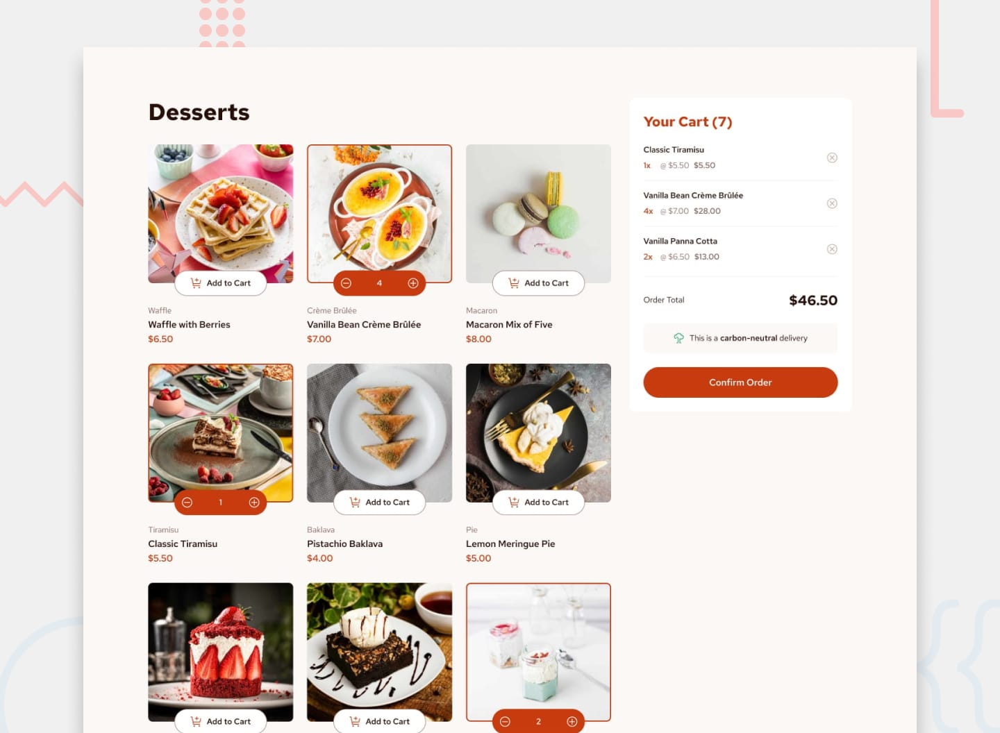

# Frontend Mentor - Product list with cart

This is a solution to the [Product list with cart challenge on Frontend Mentor](https://www.frontendmentor.io/challenges/product-list-with-cart-5MmqLVAp_d). Frontend Mentor challenges help you improve your coding skills by building realistic projects. 

## Table of contents

- [Overview](#overview)
  - [The challenge](#the-challenge)
  - [Links](#links)
- [My process](#my-process)
  - [Built with](#built-with)
  - [What I learned](#what-i-learned)
  - [Useful resources](#useful-resources)
- [How to Run](#how-to-run)
- [Author](#author)
- [Acknowledgments](#acknowledgments)

## Overview

### The challenge

Users should be able to:

- Add items to the cart and remove them
- Increase/decrease the number of items in the cart
- See an order confirmation modal when they click "Confirm Order"
- Reset their selections when they click "Start New Order"
- View the optimal layout for the interface depending on their device's screen size
- See hover and focus states for all interactive elements on the page

### Links

- Solution URL: https://github.com/Nikhila-DN/Product-list-with-Cart.git
- Live Site URL: https://product-list-with-cart-dn.netlify.app/

## My process

### Built with

- Semantic HTML5 markup
- CSS custom properties
- Flexbox
- CSS Grid
- Mobile-first workflow
- [Vite](https://vite.dev/) - The Build Tool for the Web; The default Vite plugin for React projects
- [React](https://reactjs.org/) - JS library
- [Ant Design]( https://ant.design) - An enterprise-class UI design language and React components implementation
- [Styled Components](https://styled-components.com/) - For styles

### What I learned
### Useful resources
- [Vite](https://vite.dev/) - The Build Tool for the Web; The default Vite plugin for React projects
- [React](https://reactjs.org/) - JS library
- [Ant Design]( https://ant.design) - An enterprise-class UI design language and React components implementation

## Author

- Nikhila
- Frontend Mentor - [@Nikhila-DN]([https://www.frontendmentor.io/profile/Nikhila-DN])

## How to Run

- Download Zip from Repo
- Unzip
- Inside the Folder Download the Following and run:-
  - Install React:
      npm create vite@latest
  - Install Ant Design and React Icons
      npm install antd
      npm install react-icons --save
- Run
    npm run dev

## Acknowledgments

- Youtube

# React + Vite

This template provides a minimal setup to get React working in Vite with HMR and some ESLint rules.

Currently, two official plugins are available:

- [@vitejs/plugin-react](https://github.com/vitejs/vite-plugin-react/blob/main/packages/plugin-react/README.md) uses [Babel](https://babeljs.io/) for Fast Refresh
- [@vitejs/plugin-react-swc](https://github.com/vitejs/vite-plugin-react-swc) uses [SWC](https://swc.rs/) for Fast Refresh
